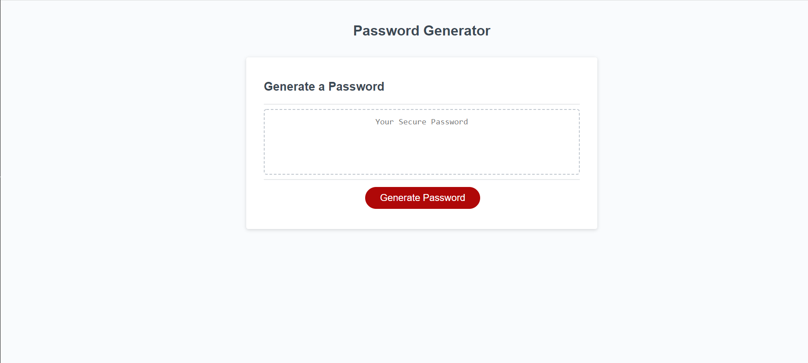

# Password Generator Starter Code

* As an employee with access to sensitive data, I want to be able to randomly generate a password that meets criteria which I choose, so that I can create a strong password with greater security. 

## Description

* Starter code was provided for the structure and look of the password generator website, but the code was altered in order to be able to take in user input such as desired length and criteria for certain characters to generate a new password for the user. The website can be utilized multiple times with different inputs from the user to create a new desired password each time. 

## Codebase Criteria

* It is done when the button to generate a password prompts the user for a series of criteria including:
    - Length of password (between 8-128 characters)
    - If it should include lowercase characters
    - If it should include uppercase characters
    - If it should include numeric characters
    - If it should include special characters

* It is done when there is confirmation that at least one character type was selected. 

* It is done when a password is generated based on the criteria provided by the user. 

* It is done when the generated password displays properly on the webpage. 

## Screenshot

## URL
[URL to deployed application: https://rubys0806.github.io/Javascript_Challenge_3/](https://rubys0806.github.io/Javascript_Challenge_3/)